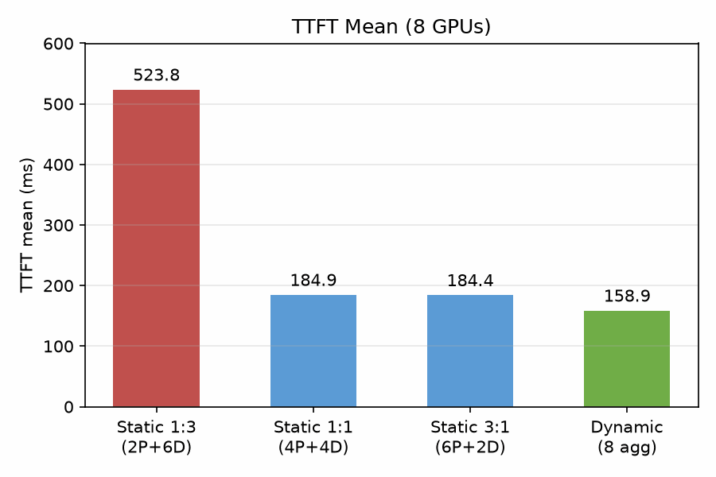
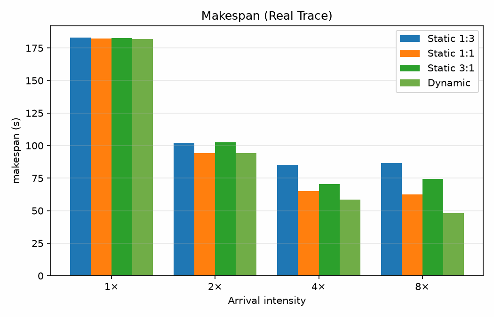
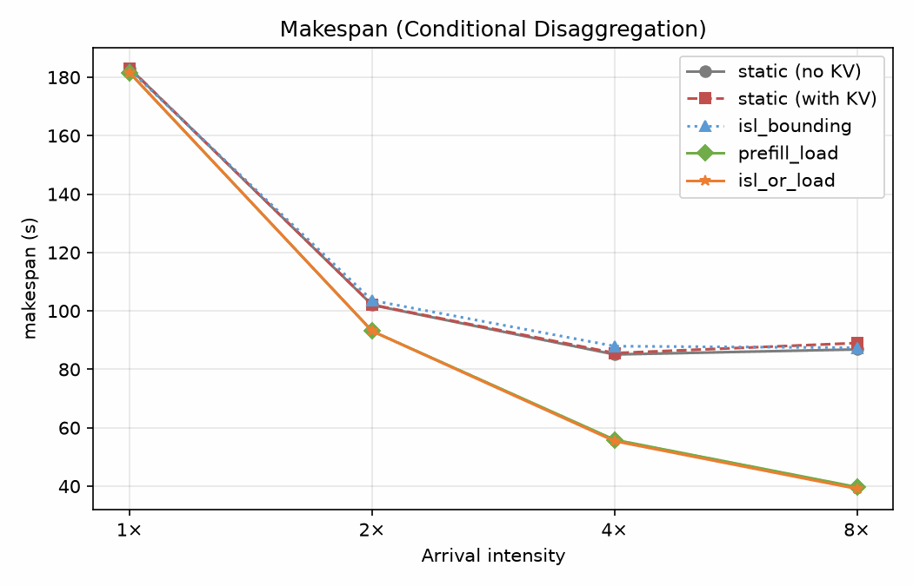

# FlowKV 式动态 Prefill-Decode 混合调度：基于 DynaSim 的仿真评估

[English](README.md)

## 摘要

本文基于 NVIDIA Dynamo 离散事件仿真引擎 DynaSim，对静态 Prefill-Decode 分离与动态混合调度两种架构进行对比评估，并实现条件分离策略的离线回放支持。结果表明，动态调度在首包延迟指标上一致优于静态配置，在真实工作负载重载条件下可节省 44.8% 的 GPU 时间。条件分离策略将部分请求的 prefill 迁移至 decode 节点，进一步消除 prefill 排队瓶颈，在 8× 到达强度下使 makespan 降低 55.4%。

## 1 引言

分离式推理将 prefill 与 decode 部署于不同节点，以隔离两类工作负载对延迟的差异化敏感度。静态配置固定 prefill 与 decode 节点比例，当负载特征偏离预设假设时导致算力浪费。本文复现 FlowKV 提出的负载感知动态混合调度方向，并利用 DynaSim 在相同负载、相同总卡数下量化动态调度相对静态配置的收益与代价。

## 2 方法

本工作不修改 Dynamo 生产运行时，采用 DynaSim（`python -m dynamo.replay`，由 Rust `lib/mocker` 驱动）进行仿真。每个 GPU 对应一个 worker，张量并行度为 1。对比三类调度配置：静态分离、动态混合（aggregated）与条件分离。

<div align="center">
<table>
  <tr>
    <td></td>
    <td></td>
    <td></td>
  </tr>
</table>
</div>

## 3 实验设置

### 3.1 闭环饱和测试

在固定请求数与并发度下测量各配置的延迟与吞吐指标。延迟单位均为毫秒。

8 卡，16000 请求，并发度 256：

<table width="100%">
  <thead>
    <tr>
      <th>配置</th>
      <th>TTFT mean</th>
      <th>TTFT p99</th>
      <th>ITL mean</th>
      <th>ITL p99</th>
      <th>E2E mean</th>
      <th>E2E p99</th>
      <th>rps</th>
      <th>总 tok/s</th>
      <th>GPU-hours</th>
    </tr>
  </thead>
  <tbody>
    <tr>
      <td>静态 1:3 (2P+6D)</td>
      <td>523.8</td>
      <td>574.2</td>
      <td>6.6</td>
      <td>6.6</td>
      <td>1357.0</td>
      <td>1408.2</td>
      <td>187.4</td>
      <td>119944</td>
      <td>0.2</td>
    </tr>
    <tr>
      <td>静态 1:1 (4P+4D)</td>
      <td>184.9</td>
      <td>349.7</td>
      <td>7.4</td>
      <td>7.8</td>
      <td>1127.9</td>
      <td>1280.4</td>
      <td>225.6</td>
      <td>144380</td>
      <td>0.2</td>
    </tr>
    <tr>
      <td>静态 3:1 (6P+2D)</td>
      <td>184.4</td>
      <td>204.8</td>
      <td>9.2</td>
      <td>9.8</td>
      <td>1355.5</td>
      <td>1374.0</td>
      <td>187.5</td>
      <td>119981</td>
      <td>0.2</td>
    </tr>
    <tr>
      <td>动态 (8 agg)</td>
      <td>158.9</td>
      <td>175.5</td>
      <td>8.3</td>
      <td>39.1</td>
      <td>1209.7</td>
      <td>1215.8</td>
      <td>210.5</td>
      <td>134701</td>
      <td>0.2</td>
    </tr>
  </tbody>
</table>

1024 卡，100 万请求，并发度 32768：

<table width="100%">
  <thead>
    <tr>
      <th>配置</th>
      <th>TTFT mean</th>
      <th>TTFT p99</th>
      <th>ITL mean</th>
      <th>ITL p99</th>
      <th>E2E mean</th>
      <th>E2E p99</th>
      <th>rps</th>
      <th>总 tok/s</th>
      <th>GPU-hours</th>
    </tr>
  </thead>
  <tbody>
    <tr>
      <td>静态 1:3 (256P+768D)</td>
      <td>528.1</td>
      <td>1024.7</td>
      <td>6.6</td>
      <td>6.6</td>
      <td>1360.9</td>
      <td>1857.0</td>
      <td>23746</td>
      <td>15197474</td>
      <td>12.0</td>
    </tr>
    <tr>
      <td>静态 1:1 (512P+512D)</td>
      <td>189.0</td>
      <td>517.1</td>
      <td>7.4</td>
      <td>7.8</td>
      <td>1131.2</td>
      <td>1462.0</td>
      <td>28592</td>
      <td>18298543</td>
      <td>9.9</td>
    </tr>
    <tr>
      <td>静态 3:1 (768P+256D)</td>
      <td>186.5</td>
      <td>348.9</td>
      <td>9.2</td>
      <td>9.8</td>
      <td>1355.8</td>
      <td>1527.6</td>
      <td>23842</td>
      <td>15258601</td>
      <td>11.9</td>
    </tr>
    <tr>
      <td>动态 (1024 agg)</td>
      <td>161.0</td>
      <td>350.7</td>
      <td>8.3</td>
      <td>39.1</td>
      <td>1209.3</td>
      <td>1391.3</td>
      <td>26801</td>
      <td>17152776</td>
      <td>10.6</td>
    </tr>
  </tbody>
</table>

### 3.2 真实 trace 开环回放

闭环饱和测试中供应时间被固化为 worker 数与持续时间的乘积，无法反映利用率差异。因此采用真实工作负载开环回放，固定总卡数，以 makespan 为指标。工作负载为 `mooncake_trace_1000.jsonl`，含 1000 请求，输入序列长度均值 9.8k，偏向 prefill 密集，通过 `--arrival-speedup-ratio` 调节到达强度。

makespan（秒）：

<table width="100%">
  <thead>
    <tr>
      <th>到达强度</th>
      <th>静态 1:3</th>
      <th>静态 1:1</th>
      <th>静态 3:1</th>
      <th>动态</th>
    </tr>
  </thead>
  <tbody>
    <tr>
      <td>1×</td>
      <td>183.03</td>
      <td>182.41</td>
      <td>182.55</td>
      <td>181.84</td>
    </tr>
    <tr>
      <td>2×</td>
      <td>102.01</td>
      <td>94.27</td>
      <td>102.40</td>
      <td>94.18</td>
    </tr>
    <tr>
      <td>4×</td>
      <td>85.08</td>
      <td>65.16</td>
      <td>70.53</td>
      <td>58.47</td>
    </tr>
    <tr>
      <td>8×</td>
      <td>86.81</td>
      <td>62.57</td>
      <td>74.26</td>
      <td>47.89</td>
    </tr>
  </tbody>
</table>

在 8× 到达强度下，动态调度相对各静态配置的改善：

<table width="100%">
  <thead>
    <tr>
      <th>对比</th>
      <th>makespan 缩短</th>
      <th>GPU 时间节省</th>
      <th>等效利用率提升</th>
    </tr>
  </thead>
  <tbody>
    <tr>
      <td>vs 1:3</td>
      <td>86.81 → 47.89s</td>
      <td>44.8%</td>
      <td>+81.3%</td>
    </tr>
    <tr>
      <td>vs 1:1</td>
      <td>62.57 → 47.89s</td>
      <td>23.5%</td>
      <td>+30.7%</td>
    </tr>
    <tr>
      <td>vs 3:1</td>
      <td>74.26 → 47.89s</td>
      <td>35.5%</td>
      <td>+55.1%</td>
    </tr>
  </tbody>
</table>

轻载条件下各配置差距有限，重载条件下动态调度的优势随到达强度单调上升，且优于该工作负载的最优固定配比。

### 3.3 条件分离

aggregated 配置为无 KV 传输的理想上界。条件分离保留静态骨架，通过策略将部分请求的 prefill 迁移至 decode 节点本地执行，更接近 FlowKV 的实际形态。策略来自 `ConditionalDisaggPolicyKind`，所有分离配置均启用 KV 传输（128KiB/token，带宽 200GB/s）。

makespan（秒）：

<table width="100%">
  <thead>
    <tr>
      <th>配置</th>
      <th>1×</th>
      <th>2×</th>
      <th>4×</th>
      <th>8×</th>
    </tr>
  </thead>
  <tbody>
    <tr>
      <td>static 无 KV</td>
      <td>183.03</td>
      <td>102.01</td>
      <td>85.08</td>
      <td>86.81</td>
    </tr>
    <tr>
      <td>static 有 KV</td>
      <td>183.04</td>
      <td>102.11</td>
      <td>85.55</td>
      <td>89.00</td>
    </tr>
    <tr>
      <td>isl_bounding</td>
      <td>182.55</td>
      <td>103.58</td>
      <td>87.92</td>
      <td>87.39</td>
    </tr>
    <tr>
      <td>prefill_load</td>
      <td>181.48</td>
      <td>93.09</td>
      <td>55.88</td>
      <td>39.67</td>
    </tr>
    <tr>
      <td>isl_or_load</td>
      <td>181.48</td>
      <td>93.06</td>
      <td>55.43</td>
      <td>39.10</td>
    </tr>
  </tbody>
</table>

bypass 率（以 `prefill_worker_idx is None` 判定）：

<table width="100%">
  <thead>
    <tr>
      <th>策略</th>
      <th>1×</th>
      <th>2×</th>
      <th>4×</th>
      <th>8×</th>
    </tr>
  </thead>
  <tbody>
    <tr>
      <td>isl_bounding</td>
      <td>0%</td>
      <td>0%</td>
      <td>0%</td>
      <td>0%</td>
    </tr>
    <tr>
      <td>prefill_load</td>
      <td>88.2%</td>
      <td>87.2%</td>
      <td>87.7%</td>
      <td>90.2%</td>
    </tr>
    <tr>
      <td>isl_or_load</td>
      <td>88.2%</td>
      <td>87.3%</td>
      <td>88.2%</td>
      <td>88.1%</td>
    </tr>
  </tbody>
</table>

## 4 讨论

本工作负载中 KV 传输开销有限，占比 0–2.5%。该负载偏向 prefill 密集，prefill 计算与排队占据主导，单请求 KV 传输约为 1.25GiB，在 200GB/s 带宽下耗时约 6.3ms，相对可忽略。短请求场景下该开销才会显著。

isl_bounding 策略在本负载下 bypass 率为 0%，因其面向短请求与热缓存场景，而该负载为冷启动，缺乏前缀复用。该策略需在多轮对话或共享前缀负载下进一步验证。

prefill_load 与 isl_or_load 策略效果显著。两个 prefill 节点被长输入序列长期占用，策略将约 88–90% 请求的 prefill 迁移至六个相对空闲的 decode 节点，消除 prefill 排队瓶颈。相对启用 KV 传输的静态基线，8× 到达强度下 makespan 降低 55.4%，TTFT 由 30.8s 降至 52ms。

## 5 结论

动态混合调度在延迟指标上一致优于静态配置，重载条件下显著提升算力利用率。条件分离策略在保留静态骨架的同时，有效消除 prefill 排队瓶颈，验证了负载感知调度的有效性。动态调度的 ITL 尾延迟偏高，源于 prefill 对 decode 的抢占，是后续优化的方向。

## 6 复现

### 6.1 依赖与编译

在 WSL 中配置 Rust 工具链与 Python 环境，编译 `dynamo._core`：

```bash
maturin develop --release --features mocker-kvbm-offload
```

DynaSim 为纯 CPU 仿真，不依赖 GPU。默认多项式性能模型对 batch 不敏感，绝对延迟不代表真实硬件，但配置间的相对对比保持自洽。

### 6.2 实验脚本

<table width="100%">
  <thead>
    <tr>
      <th>文件</th>
      <th>用途</th>
    </tr>
  </thead>
  <tbody>
    <tr>
      <td>run_ablation.py</td>
      <td>批量执行静态与动态调度各配置</td>
    </tr>
    <tr>
      <td>run_trace_ablation.py</td>
      <td>真实 trace 开环回放</td>
    </tr>
    <tr>
      <td>run_conditional_disagg_ablation.py</td>
      <td>条件分离策略消融</td>
    </tr>
    <tr>
      <td>verify_ablation.py</td>
      <td>可复现性校验</td>
    </tr>
    <tr>
      <td>trace_inspect.py</td>
      <td>工作负载特征探查</td>
    </tr>
    <tr>
      <td>plot_figures.py</td>
      <td>结果图表生成</td>
    </tr>
  </tbody>
</table>

## 7 源码改动

条件分离的离线回放支持仅涉及仿真引擎 `lib/mocker`，未改动生产运行时。

<table width="100%">
  <thead>
    <tr>
      <th>文件</th>
      <th>改动</th>
    </tr>
  </thead>
  <tbody>
    <tr>
      <td>lib/mocker/src/replay/offline/components/engine.rs</td>
      <td>暴露 prefill 池饱和信号</td>
    </tr>
    <tr>
      <td>lib/mocker/src/replay/offline/state.rs</td>
      <td>增加 bypass 状态标记</td>
    </tr>
    <tr>
      <td>lib/mocker/src/replay/offline/disagg.rs</td>
      <td>条件分离决策与本地 prefill 路由</td>
    </tr>
    <tr>
      <td>lib/mocker/src/replay/offline/extensions/kv_router/composition_disagg.rs</td>
      <td>回放配置派生与接线</td>
    </tr>
    <tr>
      <td>lib/mocker/src/replay/offline/extensions/kv_events/mod.rs</td>
      <td>保持默认禁用</td>
    </tr>
  </tbody>
</table>

策略判定 bypass 时，请求不再执行「prefill 节点计算 → 跨节点 KV 传输 → decode 节点接续」，而是直接在选定 decode 节点本地 prefill，零 KV 传输。

改动以 `conditional_disagg_replay.patch` 提供，基线为 Dynamo `v1.5.0-gemma-4-31b-dev.1`。在官方源码根目录执行：

```bash
git apply --check conditional_disagg_replay.patch
git apply conditional_disagg_replay.patch
```

## 参考文献

- Weiqing Li et al. *FlowKV: A Disaggregated Inference Framework with Low-Latency KV Cache Transfer and Load-Aware Scheduling*. arXiv:2504.03775
- NVIDIA Dynamo: https://github.com/ai-dynamo/dynamo
- LMCache: https://github.com/LMCache/LMCache
